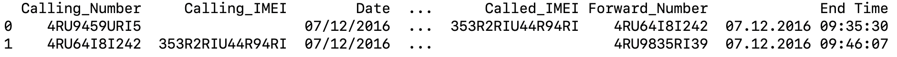

# CMI_programmation

## Séance d'introduction

Cette première séance fait une revue du langage python afin de poser les bases.

### Structures de données

 `python`propose essentiellement deux structures de données: les _listes_ et les _dictionnaires_.
 
* Les **listes** regroupent des items de type variés dont l'ordre importe dans la liste: on accès aux éléments de la liste à partir de leur indice (qui commence à 0). A noter, c'est une particulartié de `python`, que les éléments n'ont pas nécessairement à être de même type.
    * `range` permet de créer une liste d'entiers consécutifs (pratique pour effectuer une simple itération
    * `for x in L`
    * `L[i]`, `L[:i]`, `L[i:]`, `L[-i]`, etc.
* Construction d'une liste à la volée (List Comprehension) `[x^2 for x in range(10)]`
    * Tri
    * Filtrage d'une liste `filter(lambda x: math.sqrt(x) < 2, range(10))`
    * On peut parcourir une liste en itératn simultanément sur ses valeurs et ses indices (pratique !) `for i, x in enumerate(L)`

* Les **dictionnaires** sont des ensembles de paires (clé, valeur) dont l'ordre n'importe pas.
    * On peut accéder aux clés du dictionnaire `D.keys()`, ou à ses valeurs `D.values()` ou à ses paires `D.items()`

* Les **ensembles** (`S = set()`) stockent des éléments (de type varié), sans répétition possible (alors que c'ets possible pour une liste) et sans respect d'un ordre particulier.

### Fichiers

Un fichier, au sens `python`, correspond au contenu d'un fichier pysique (stocké sur disque). Il requière d'y accéder en l'_ouvrant_ (et en le _fermant_ après utilisation), et en demandant de lire le contenu (tout ou partie).

* Ouverture d’un fichier (`open`)
    * Erreur `FileNotFoundError`
    * Traitement des erreurs (et exceptions) `try`, `except`
    * Méthodes `close`, `write`, `read`, `readline`
    * Instruction `with`

Chemin d’un fichier: syntaxe d’un chemin absolu, relatif, concaténation de chemin

[Librairie `csv`](https://docs.python.org/3/library/csv.html), qui permet d'accéder au contenu d'un fichier suivant ce format.

### Exercices

Une première série d'exercices exige de manipuler le contenu du fichier `csv` des appels téléphoniques.

* **Exercice**. Vérifier que les champs Date et Heure comporte toujours une valeur. Même chose pour le champ Duration.
    * Vous utiliserez la librairie csv qui permet d’accéder aux champs d’une ligne à partir des entêtes de colonnes.
* **Exercice**. Calculer la durée d’une conversation:
	 * Moyenne, Médiane, Min, Max, Ecart-type
	 * *Le calcul de la médiane n'ets pas immédiat (par un simple parcours des valeurs), il faut s'en remettre à l'utilisation d'une librairie qui calcule la médiane à partir de la liste de toutes les valeurs.*
	 * Histogramme, Distribution ?
	 * Difficultés techniques: extraire la durée (en heure:minutes:secondes) convertie en secondes depuis trois chaînes de caractères
* **Exercice**. Combien y a t-il d’appel chaque jour de la semaine ?
	 * Les week-ends font-ils exception ?
* **Exercice**. Les appels ont-ils lieu plutôt en matinée, en soirée, en milieu de journée ?
* **Exercice**. Combien d’appels émet un même numéro de téléphone ?
	 * Moyenne, Médiane, Min, Max, Ecart-type
	 * Histogramme, Distribution ?
	 * Idem avec les appels entrants.
* **Exercice**. Combien de numéro de téléphones différents ont été relevés ? A-t-on un numéro IMEI pour tous les téléphones ? Un numéro IMEI est-il associé à un unique numéro de téléphone ?
* **Exercice**. Y a-t-il un numéro qui reçoit plutôt des appels entrants ? ou sortants ?
* **Exercice**. Y a-t-il deux numéros de téléphone qui s’appellent plus souvent (que les autres) ?

## Chaîne de caractères
Chaînes de caractères, longueur, première, dernière lettre, majuscule, minuscule, sous-chaîne ...

Chaînes de caractère paramétrées (pour affichage): `f’string’`, `string.format()`

Expression régulière ([librairie `re`](https://docs.python.org/3/library/re.html)), recherche de _motifs_ dans une chaîne de caractères.

### Exercices

Cette seconde série d'exercices exigent d'utiliser des dictionnaires, et de rechercher des expressions régulières dans les mots (on considère le fichier des mots de la langue française).

* **Exercice**. Calculez pour chacune des lettres de l’alphabet, y compris les lettres accentuées (à, â, é, ê, è, etc.):
    * Le nombre de mots débutant par cette lettre.
    * Le nombre d'instances de cette lettre dans le dictionnaire (la liste de mots contenue dans le fichier).
Vous utiliserez un dictionnaire indexé par les lettres, dont les valeurs seront initialisées à 0
Vous itérerez sur le fichier de mots, en incrémentant l’entrée correspondante du dictionnaire
* **Exercice**. Combien de mots contiennent la double consonne « tt » ? Combien de mots contiennent une double consonne ? Combien de mots contiennent deux fois la lettre « z » ?
* **Exercice**. Combien de mots se terminent par les lettres « ge » ?

## `pandas` et `DataFrame`(s)
Manipulations de données tabulaires, numériques et non numériques.

[Librairie `pandas`](https://pandas.pydata.org/docs/getting_started/intro_tutorials/index.html)

Formalisation des données en individus (lignes) x variables observées (colonnes): les colonnes sont "typées" (toutes les entrées d'une même colonne sont de même type).

Le parallèle entre la structure d'un DataFrame et celui d'un tableur, ou de données décrites sous format csv est immédiat. Si on prend les deux premières ligens du fichier:

`L = [{'Calling_Number': '4RU9459URI5', 'Calling_IMEI': '', 'Date': '07/12/2016', 'Heure': '09:35:02', 'Type': 'Incoming Call', 'Duration': '00:00:28', 'Called_Number': '4RU64I8I242' , 'Called_IMEI': '353R2RIU44R94RI', 'Forward_Number': '4RU64I8I242', 'End Time': '07.12.2016 09:35:30'}, {'Calling_Number': '4RU64I8I242', 'Calling_IMEI': '353R2RIU44R94RI', 'Date': '07/12/2016', 'Heure': '09:46:00', 'Type': 'Outgoing Call', 'Duration': '00:00:07', 'Called_Number': '4RU9835RI39' , 'Called_IMEI': '', 'Forward_Number': '4RU9835RI39', 'End Time': '07.12.2016 09:46:07'}]`

`df = DataFrame(L)`

`df.to_dict()`

* Variable = variable aléatoire, donc calcul de statistiques descriptives sur la variable
Recherche de corrélation entre variables
* Lignes = individus, sélection d’un échantillon de la population sur la base d’une valeur d’une variable (d’un attribut)
* Etc.

### Exercices

Explorer la librarie pandas (trouver les méthodes) qui permettent:

* **Exercice**. De _filtrer_ (et ainsi obtenir un autre DataFrame) les données pour ne retenir que les appels d'un numéro donné.
* **Exercice**. De _convertir_ la durée exprimées en heures:minutes:secondes en secondes.
* **Exercice**. De calculer le _temps moyen_ d'une conversation pour un numéro de téléphone donné.
