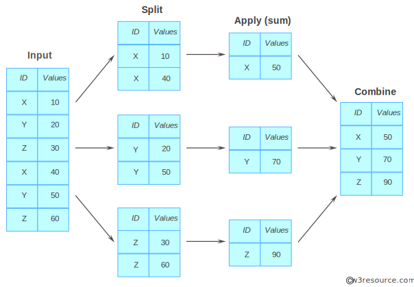

# CMI_programmation

## Séance 2 - pandas et `DataFrame`

Cette séance poursuit et creuse les possibilités offertes par pandas.

### `DataFrame`

La librairie pandas offre une structure de données: les `DataFrame` (et leur version à une dimension les `Series`), et une variété de méthodes pour les manipuler et pour tirer des informations sur la population (lignes) et les variables (colonnes) qui y sont stockées.

Ces exercices consistent à explorer les possibités de la librairie. Ils vous mettent au défi de toruver la réponse en fouillant sur le net (documentation python, W3C School, blogs de développeurs, etc.).

On reprend l'exemple des données d'appels téléphoniques (fichier `appels_telTEL.csv`), chargé dans un `DataFrame` qu'on appelera `df_TEL`.

### Lecture et sauvegarde d'un `DataFrame`

* **Exercice.** Peut-on sauvegarder un DataFrame sur disque ? Quels sont les formats possibles et leurs avantages/inconvénients ? Quelles sont les méthodes pour charger le DataFrame en mémoire depuis chacun de ces formats ?
    * [Un article intéressant à lire](https://towardsdatascience.com/the-best-format-to-save-pandas-data-414dca023e0d) pour en savoir plus sur les formats et leurs "performances" respectives.

### Manipuler un `DataFrame`

* **Exercice.** Peut-on appliquer une fonction aux éléments d'une colonne d'un DataFrame ? Comment peut-on créer une nouvelle colonne du DataFrame qui contient le résultat de cette fonction ?
	* Appliquer cette "astuce" pour créer dans `df_TEL` une colonne qui contient la durée en secondes de l'appel.

* **Exercice.** Lorsqu'une colonne contient des valeurs numériques, on peut obtenir facilement le calcul de la moyenne, max, min et écart-type de la variable. Calculer la durée moyenne, puis max et min d'un appel, et l'écart-type de cette durée.

* **Exercice.** Peut-on appliquer une fonction aux éléments de plus d'une colonne d'un DataFrame (et créer une une nouvelle colonne qui contient le résultat) ?
	* Appliquer cette "astuce" pour créer dans `df_TEL` une colonne qui contient un élément de type `datetime`(une date et pas une simple chaîne de caractères) qui correspond aux champs `Date`et `Heure`.
	* Utiliser cette valeur en format `datetime` pour calculer le jour de la smeaine de l'appel (et le stocker dans une autre colonne).

### Filtrer un `DataFrame`

* **Exercice.** Calculer le temps total des appels initiés par la porteur du numéro (`Calling_Number`) `4RU64I8I242`.
 * Procéder en ne préservant que les lignes dont la valeur du champ `Calling_Number`a la valeur `4RU64I8I242`
 * Appliquer la fonction somme (`sum`) à la colonne `Duration_sec` qui donne la durée d'un appel en secondes.

* Combien d'appels sont d'une durée de plus d'un quart d'heure ?
 * Ne retenez que les lignes pour lesquelles la valeur du champ `Duration_sec` excède le quart d'heure, puis accéder au nombre de lignes du DataFrame ainsi obtenu (à l'iade de l'attribut `shape`d'un `DataFrame`).

### Trier un `DataFrame`

Trouver la méthode qui permet de trier les entrées (lignes) d'un `DataFrame`. explorer les paramètres qui permettent de trier en ordre ascendant ou descendant. Peut-on trier selon plusieurs critères (plusieurs colonnes) ?

### Regrouper les lignes d'un `DataFrame`

Trouver la méthode qui permet de regrouper les lignes d'un `DataFrame` selon les valeurs présentes dans une colonne donnée. Cela dit, le regroupement des lignes n'est pas la fin en soi du regroupement des lignes, l'objectif étant de calculer une valeur pour chacun des groupes à partir des valeurs pour une colonne des éléments du groupe (comme l'illustre le schéma).

 
* **Exercice.**  Utiliser cette méthode pour calculer le temps moyen d'un appel pour chacun des jours de la semaine.

* **Exercice.**  Utiliser cette méthode pour calculer le temps moyen d'un appel pour chacun des jours de la semaine pour le numéro de téléphone `4RU64I8I242`.

* **Exercice.**  Avec qui l'utilisateur `4RU64I8I242` a-t-il passer le plus de temps au téléphone (durée totale des appels) ? Procédez avec ordre:
 * On filtre par rapport à l'appelant (`4RU64I8I242`)
 * On regroupe selon les numéros appelés (`Called_Number`), et on effectue la somme des durée d'appels (`sum`sur le champ `Duration_Sec`)
 * On prend soin de nommer la colonne qui reçoit le résultat
 * On trie sur cette nouvelle colonne en ordre décroissant

	

