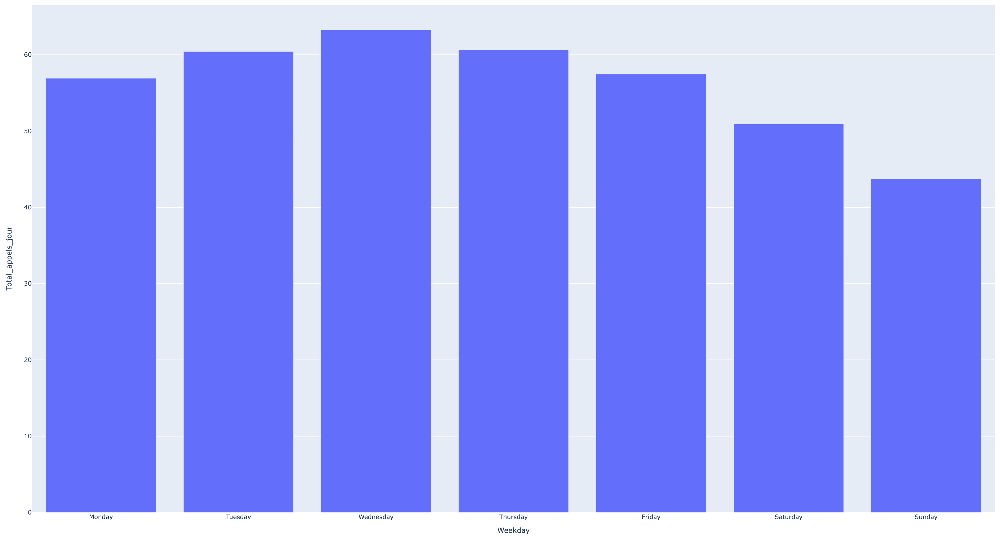
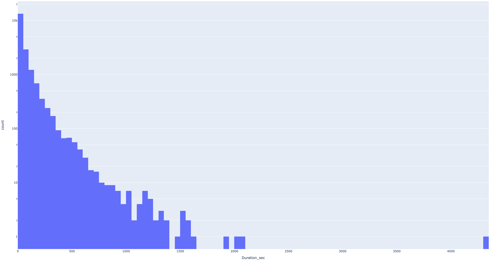
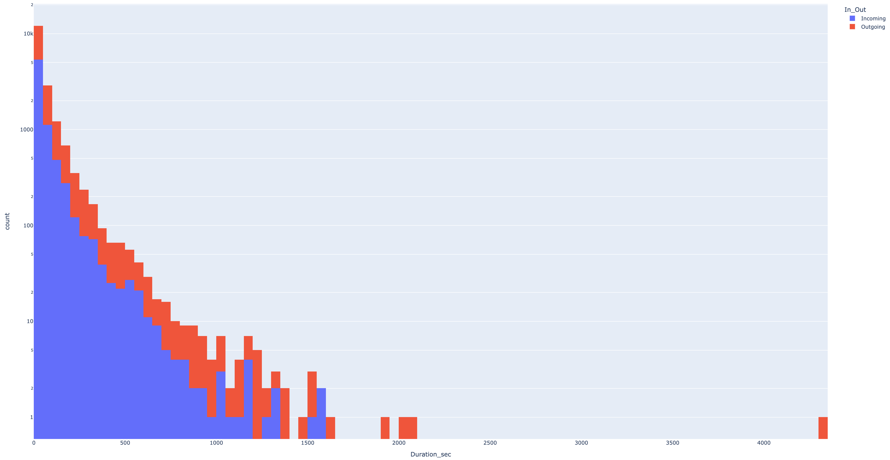

# CMI_programmation

## Séance 2 - visualisations avec `plotly`

La librairie `plotly` propose un ensemble de méthodes et d'objets graphique spour construire des visualisations (histogramme, nuages de points, etc.).

[Accédez à l'ensemble des visualisations proposées avec des exemples.](https://plotly.com/python/plotly-express/#gallery)

On reprend encore ici les données sur les appels téléphoniques.

### Histogrammes (`barchart`)

* **Exercice.** Construisez une visualisation à l'aide d'un histogramme des temps moyen d'appels selon les jours de la semaine.
 * Savez-vous obtenir une visualisation où les jours sont ordonnés (`Monday`, `Tuesday`, ..., `Sunday`) ?

* Obtenez un histogramme qui cette fois donne une idée de la distribution des durées des appels.
 * Attention à bien choisir le nombre de "bins" pour y voir quelque chose
 * On peut aussi passer l'ordonnées en échelle logarithmiques (puisqu'on a affaire à une loi de puissance)

* Construisez une visualisation qui "empile" les histogrammes, l'un des durées des appels entrants, l'autre des durées des appels sortants

