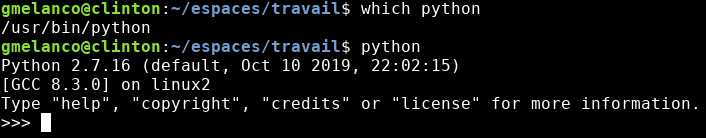
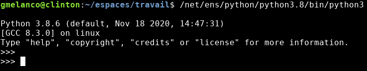
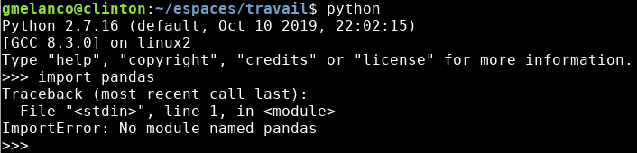
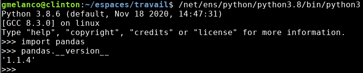
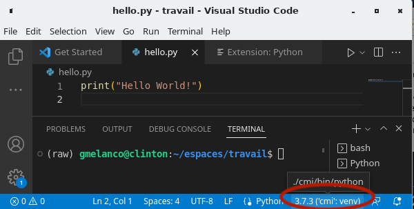

# CMI_programmation

## Travailler en environnements multiples

### Fonctionnement de `python`et de `pip`

> Lorsque vous taper la commande `python`, savez-vous dire ce qu'il se passe ? Où est situé sur votre disque ce programme, l'interpréteur `python`, qui est lancé ? Lorsque vous utilisez VS Code, quel est l'interpréteur qui ets utilisé ? Celui du système ou un interpréteur géré localement par l'éditeur ?

Ces questions sont importantes lorsque vient le moment de déployer votre pplication sur un serveur (si on parle d'une webapp), ou de l'installer sur le poste d'un collaborateur qui n'a pas forcément le même environnement de travail que vous ...

Il existe vraisemblablement une `python` utilisé par votre système (le système d'exploitation de votre ordinateur). Si vous faites (essayez !):

`which python`

vous saurez quel instance de python est lancée par défaut.

Parfois, on peut forcer le lancement d'une autre instance de `python` (s'il en existe une autre):

Chacune de ces versions possèdent ses propres librairies (qu'il a fallu installer de manière indépendante). Par exemple, dans l'environnement `python 2.7` la librairie `pandas`n'est pas disponible:
 

 
 alors qu'elle l'est dans l'environnement `python 3`:
 

### Gérer ses environnements

Pourquoi s'embêter à gérer plusieurs environnements ?

* Peut-être parce que la version de `python` qui est installée par défaut ne convient pas (pas assez récente)
    * Il ne faut pas s'aventurer à la modifier s'il s'agit de la version du système au risque d'impacter des fonctionnalités du système.
* Pour éviter de "polluer" une version en y installant toutes les librairies exigées de tous les projets, allant du calcul scientifique, au traitement d'images, en passant par le traitement de la langue naturelle, de la gestion d'interfaces utilisateurs, etc.
    * De plus, les librairies induisent certaines dépendances, cette librairie exigera une version antérieure de `numpy` alors qu'une autre exigera la version la plus récente ...

Pour composer avec cette situation, il convient de définir un environnement propre à chaque projet. Cela permet d'installer une librairie dans cet environnement sans impacter les autres. En fin de projet, on reste libre de suppprimer cet environnement et les librairie qu'il a fallu y installer.

Les environnements se gèrent avec __`venv`__, une commande propre à la gestion d'environnements sous `python`. Il vous faut au départ disposer d'une installation de base d'un interpréteur `python` (qui sera l'interpréteur exécuté dans cet environnement), puis de créer un espace où serotn stockées les ressources de l'environnement:

`python -m venv <` _chemin vers l'installation de votre environnement_ `>`

comme par exemple, en supposant qu'on se trouve dans le dossier `~/espaces/travail/` (au CREMI): `python -m venv ./CMI` créera un environnement appelé `CMI`.

On peut ensuite "_activer_" cet environnement en faisant:

`source ./CMI/bin/activate`

Le lancement de `python` correspondra alors à l'instance de python utilisée à la création de l'environnement `CMI`. Les librairies installées dans cet environnement seront connues et accessibles de cet environnement et seulement celui-là.

Par exemple, `pip install plotly-express` installera `plotly` qui ne sera ccessible que de cet environnement.

* **Exercice.** Créez un environnement que vous utiliserez pendant les TDs du cours. Vous créerez plus tard un environnement propre à votre projet.

En fin de session (de travail), ou s'il vous faut passer à un autre environnement pour un autre projet, vous pouvez "désactiver" l'environnement courant en tapant simplement:

`deactivate`

### `venv`  et VS Code

L'éditeur (comme nombre d'autres éditeurs) détecte les environnements `python` qui sont disponibles (dès lors que vous édité un fichier `python`).

Vous pouve alors choisir l'environnement à utiliser pour exécuter le code d'un fichier, via la barre de contrôle qui se situe au bas de la fenêtre de l'éditeur.

### Environnements, dépendances entre librairies et installation d'un app

Les gestionnaires d'environnements permettent souvent de connaître les librairies qui ont été installées dans un environnement, et précisent les différentes versions de celles-ci qui sont utilisées. Avec `venv`, on fait appel à `pip` pour connaître la liste des librairies:

`pip freeze`

__

Imaginons un environnement dans lequel vous développez une application des tinée à être diffusé à des utilisateurs intéressés l'installer pour leur propre besoin. Votre applicaiton s'appuie sur un certain nombre de librairies python, celles que vous avez installées et celles _qui ont été installées_ par cascade (de dépendances gérées par `pip`).

On peut alors fabriquer un fichier `requirements.txt` précisant les dépendances de l'application, qui permettra une installation rapide d'un environnement compatible avec l'application.

`pip install -r requirements.txt`

avec le fichier `requirements.txt` typiquement obtenu en faisant:

`pip freeze > requirements.txt`

Le fichier `requirements.txt` suivt un format simplissime, listant les librairies (une sur chaque ligne), comme par exemple:

`pandas`

`lxml==3.2.3`

`numpy>=1.7.1`

où la version peut être précisée (égale à ou au moins aussi récente que ...).

